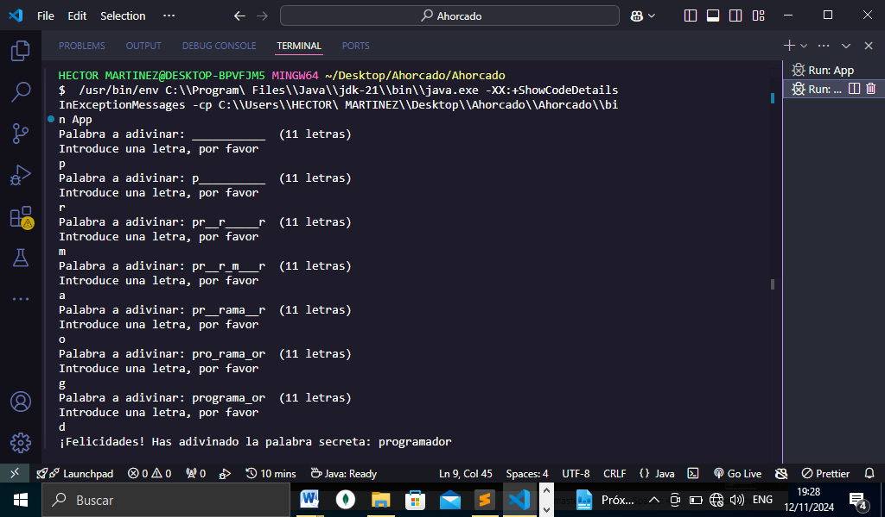
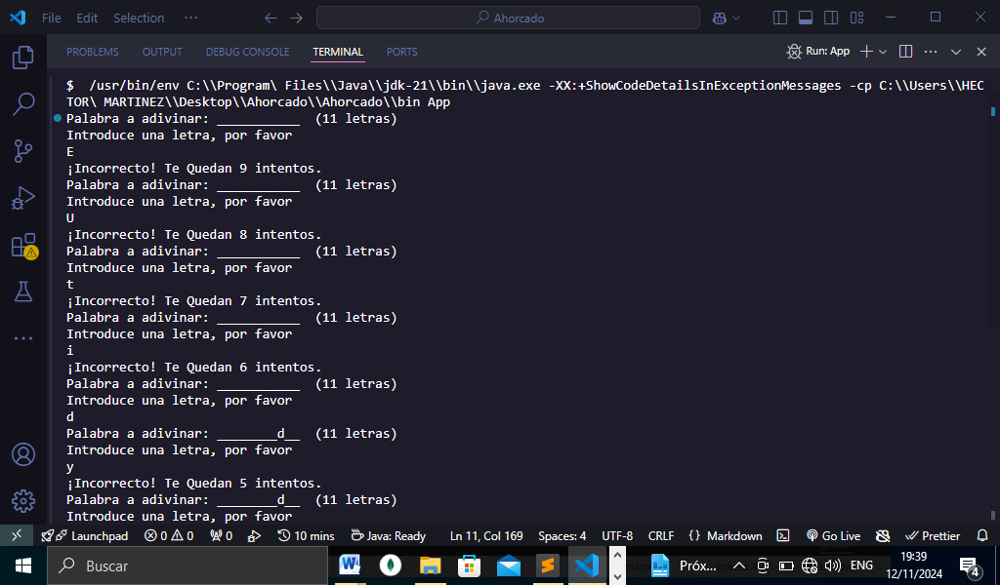
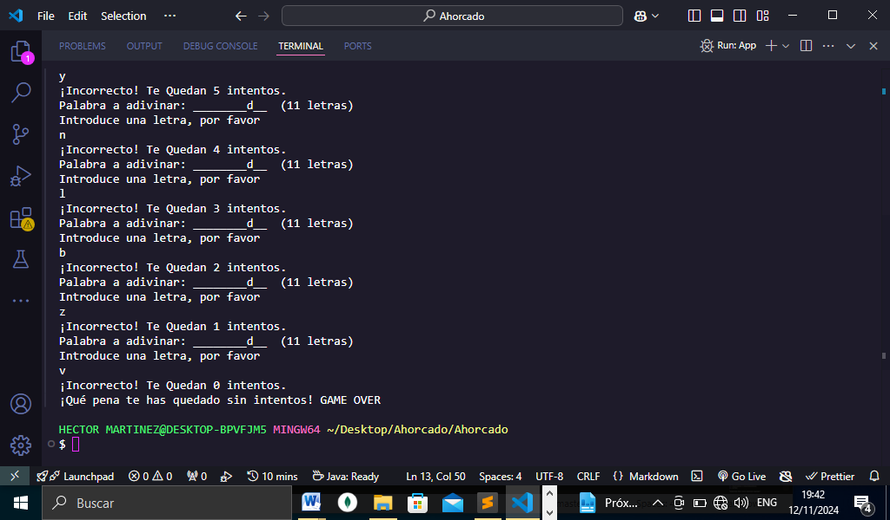

# TITULO DEL PROYECTO    

**Juego Del Ahorcado Usando Java**

# DESCRIPCIÓN DEL PROYECTO (Programa Realizado en Java)
**Este pequeño proyecto realizado con el lenguaje de programación de Java, se trata de un juego conocido como el juego del ahorcado donde el usuario deberá adivinar la palabra oculta que se encuentra en el programa, todo se realizó mediante la consola, donde se le pedirá al usuario que ingrese letra por letra hasta que logre adivinarla, el usuario contara con un número máximo de intentos si logra adivinarla ganara el juego de lo contrario el juego se acabara, cabe señalar que esta práctica se realizó con el propósito de poder entender cómo se programa en el lenguaje de programación(Java),declaración de variables, estructuras de arreglos, estructuras de control condicionales además como funciona los ciclos en Java y algunos métodos que son exclusivos de Java para poder manipular strings entre otras cosas más que hicimos para poder darle funcionalidad al juego. A continuación se explicara más a detalle y parte por parte en código como realizamos este pequeño proyecto**

# VISTA PREVIA DE LA PRACTICA REALIZADA CUANDO EL USUARIO LOGRO ADIVINAR LA PALABRA SECRETA INGRESADA EN EL PROGRAMA.


# VISTA PREVIA DE LA PRACTICA REALIZADA CUANDO EL USUARIO NO LOGRO ADIVINAR LA PALABRA SECRETA INGRESADA EN EL PROGRAMA DURANTE EL INTENTO MAXIMO QUE FUERON 10 INTENTOS.



## USO DE CLASE SCANNER EN JAVA
**Primero lo que hicimos en nuestra practica fue importar la clase Scanner con esta clase podemos pedir datos al usuario y que el usuario puede ingresar los datos en este caso le pediremos que valla ingresando letra por letra quedando de la siguiente manera como se puede ver en nuestro archivo App.java de nuestro repositorio**

```Java
    import java.util.Scanner;
    // clase scanner que nos permite que el usuario escriba
    Scanner scanner = new Scanner(System.in);
```

## DECLARACION DE VARIABLES EN JAVA
**Para realizar esta práctica vamos a  declarar unas variables para poder llevar el control del juego(la palabra adivinar, intentos, intentos máximos, una variable booleana para el control de la palabra adivinada) las siguientes variables declaradas en Java como se muestra en el siguiente código:**
```Java
    // Declaraciones y asignaciones
        String palabraSecreta = "programador";
        int intentosMaximos = 10;
        int intentos = 0;
        boolean palabraAdivinada = false;
```

## GENERANDO ARREGLOS EN JAVA PARA NUESTRA PRACTICA
**En esta parte de la práctica vamos a declarar un arreglo de tipo char, es decir un arreglo de letras para poder saber  cuantas letras contiene la palabra adivinar colocando el método length como se puede apreciar a continuación:**
```Java
    char[] letrasAdivinadas = new char[palabraSecreta.length()];
```

## ESTRUCTURA DE CONTROL ITERACTIVA(BUCLE FOR)
**Para poder colocar los guiones bajos donde va cada letra al estilo del juego del ahorcado hacemos uso del ciclo for para poder colocar el número de guiones que contiene la palabra secreta que tiene que adivinar como se muestra a continuación:**
```Java
        // Estructura de control interactiva(Bucle)
        for(int i = 0; i < letrasAdivinadas.length; i++){
            letrasAdivinadas[i] = '_';
        }
```
## ESTRUCTURA DE CONTROL ITERACTIVA(CICLO WHILE)
**Usamos un ciclo while para que siga adivinando hasta que se acaben los intentos o adivine la palabra para eso usamos el ciclo while colocando la condición negada para que sea true y entre al ciclo además también que los intentos sean menor a los intentos máximos:**
```Java
    while(!palabraAdivinada && intentos < intentosMaximos){
        // código completo en el archivo del repositorio(App.java)
    }
```
## METODO DE STRINGS EN JAVA(charAt(0) y Character.toLowerCase)
**Hicimos uso de la clase scanner para que el usuario escriba la letra y de enter y siga escribiendo pero para poder llevar el control de la primera que ingreso usamos el método de strings charAt en la posición cero, ahora bien para poder convertir a minúsculas en caso de que el usuario escriba en mayúsculas y no tener problemas a la hora de adivinar la palabra empleamos el método Character.toLowerCase es decir el primer carácter conviértelo en minúsculas como se muestra en la siguiente línea de código:**
```Java
    // Usamos la clase scanner para pedir una letra
    char letra = Character.toLowerCase(scanner.next().charAt(0));
```
## VARIABLE BOOLEANA,CICLO FOR Y CONDICIONAL IF EN JAVA
**Ahora para poder llevar el control de la letra que ingresa el usuario y esta esté correcta declaramos una variable booleana inicializada en false, después un ciclo for para que compruebe si la letra es correcta y en que posiciones se encuentra en caso de que la palabra contenga la misma letra pero en otra posición de ser así colocamos un if para decir que la letra es correcta o de lo contrario es incorrecta teniendo en cuenta la cantidad de intentos y si es incorrecta vaya descontando los intentos lo hacemos con una resta como se muestra a continuación:**
```Java
     // Estructura de control iterativa (Bucle)
    for(int i = 0; i < palabraSecreta.length(); i++){
        // Estructura de control condicional
        if(palabraSecreta.charAt(i) == letra){
            letrasAdivinadas[i] = letra;
            letraCorrecta = true;

        }
    }
    if(!letraCorrecta){
        intentos++;
            System.out.println("¡Incorrecto! Te Quedan " + (intentosMaximos - intentos) + " intentos.");
    }
```
## VALIDACION SI LAS LETRAS QUE INGRESO EL USUARIO SON IGUALES A LA PALABRA A ADIVINAR(Métodos equals y String.valueOf)
**Ahora para poder validar las letras con la palabra a adivinar son igual hacemos uso de la estructura de control if para validar, además el método String.value of lo usamos cuando tenemos un array de tipo char y queremos que ese arreglo de char se convierta en un string por decirlo así y poderlo comparar con el método equals y saber si el arreglo de char es igual a la palabra que es un string como se muestra el siguiente código(Código completo en el archivo App.java de nuestro repositorio)**
```Java
    if(String.valueOf(letrasAdivinadas).equals(palabraSecreta)){
        palabraAdivinada = true;
        System.out.println("¡Felicidades! Has adivinado la palabra secreta: " + palabraSecreta); 
    }
```
## FINALIZACION DEL JUEGO EN CASO DE  QUE NO HAYA ADIVINADO LA PALABRA(Condicional if y scanner.close())
**Para poder finalizar el juego en caso de que el usuario no haya adivinado la palabra es decir que los intentos se terminen usamos también un if para validar eso. Colocamos un mensaje en la consola que el juego ha terminado y por ultimo hacemos uso de scanner.close para cerrar la finalización del programa y que el usuario ya no escriba como se muestra a continuación:**
```Java
    if(!palabraAdivinada){
        System.out.println("¡Qué pena te has quedado sin intentos! GAME OVER");
    }
    scanner.close();
```

### Lista De Herramientas, Tecnologías Y Propiedades Que Usamos En La Práctica Del Juego Del Ahorcado   

1. Visual Studio Code
2. Lenguaje De Programación(Java)
3. Consola(La Terminal Para Ejecutar El Programa)
4. Clase Scanner(Java)
5. Declaración Y Asignaciones De Variables(Java)
6. Estructura De Control Condicional(If Java)
7. Arreglos(Java) 
8. Estructura De Control Iterativa(Ciclo For Java) 
9. Estructura De Control Iterativa(Ciclo While Java)
10. Clase String Y Sus Métodos(ValueOf,CharAt Y Length)
11. Método En Java(Equals) 
12. Clase Character Y Su Método(ToLowerCase) 
13. GitHub

*Elaborado Por: Mario Martínez Aguilar*
